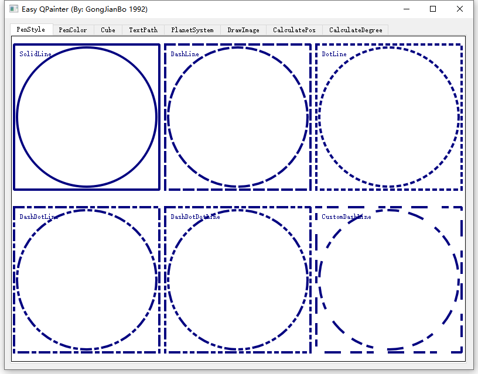
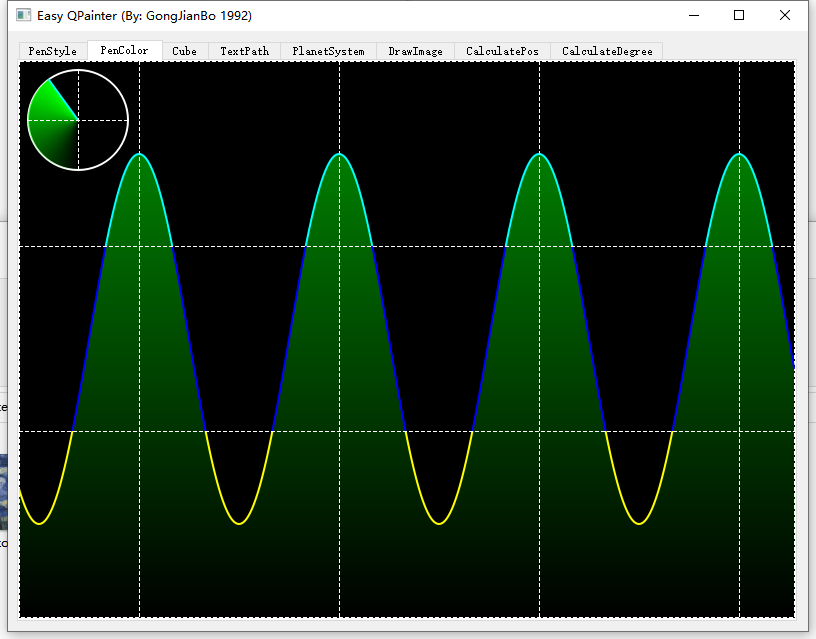
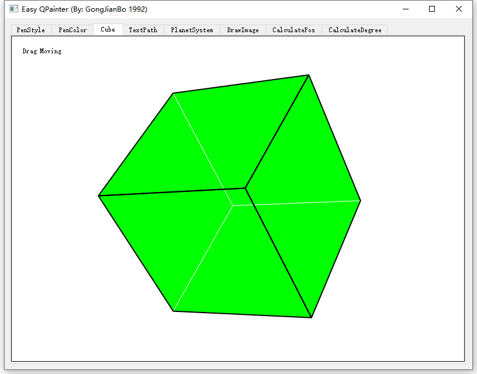
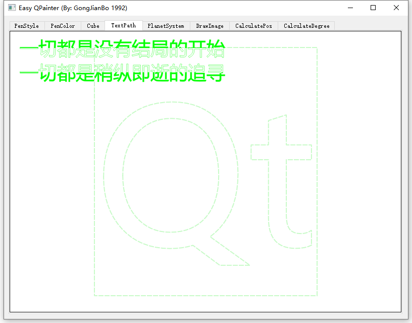
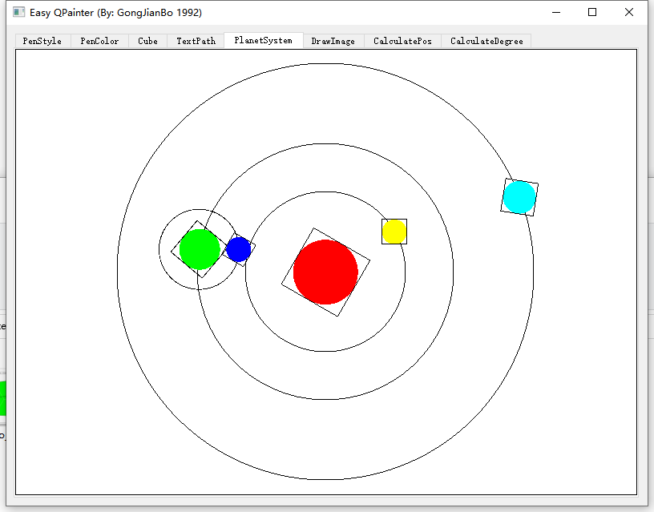
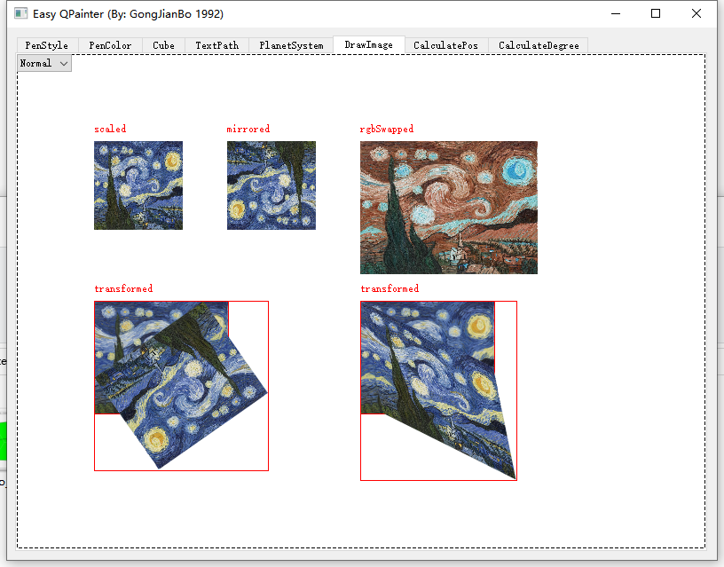
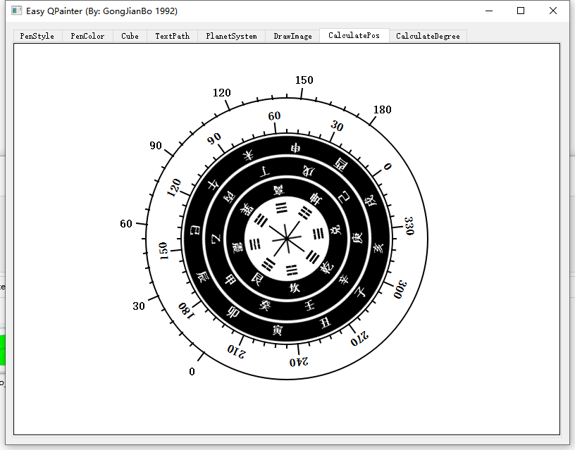
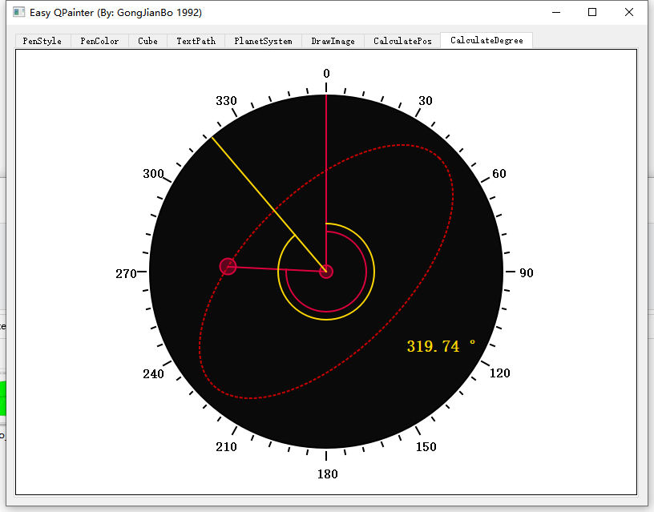

# EasyQPainter 
Various operation practices of Qt QPainer.（Qt QPainter的各种操作实践）
I named this demo "What is QPainer".（我给这个 Demo 命名为 "何为 QPainter"）
###### （QQ 交流群：647637553）

# Environment （开发环境）
（2020-7-19）Qt5.15.0 + MSVC2019 32bit
###### （There might be some incompatibility between different QT version header directives, please adjust includes based on your QT SDK version.  版本之间可能有些接口不兼容，或者头文件变动，请自行调整。如我 5.12 放到 5.15 上就需要显式引入 QPianterPath 了。）

# Demo Show （展示）

