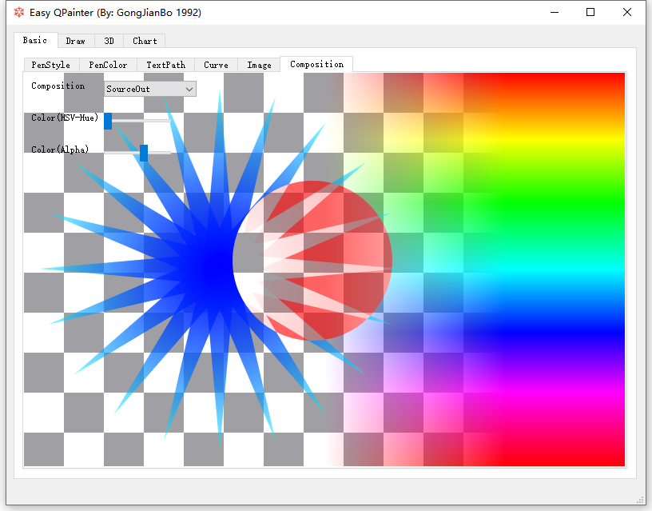

# EasyQPainter 

Various operation practices of Qt QPainter.（Qt QPainter 的各种操作实践）

I named this demo "What is QPainter".（我给这个 Demo 命名为 "何为 QPainter"）

# Environment （开发环境）

（2024-07-02）Win10/Win11 64bit + Qt5.15.2/Qt6.7.2 + MSVC2019/MSVC2022 64bit

# Note  (备注)

### version compatible（版本兼容 2022-06-26）

There might be some incompatibility between different QT version header directives, please adjust includes based on your QT SDK version. （版本之间可能有些接口不兼容，或者头文件变动，请自行调整）
> 如：低版本升级到 Qt5.15 上需要显式引入 QPainterPath；QWheelEvent pos() 需改用 position()，delta() 需改用 angleDelta()；QFontMetrics width() 需改用 horizontalAdvance() 等...

# Demo Show （展示）

