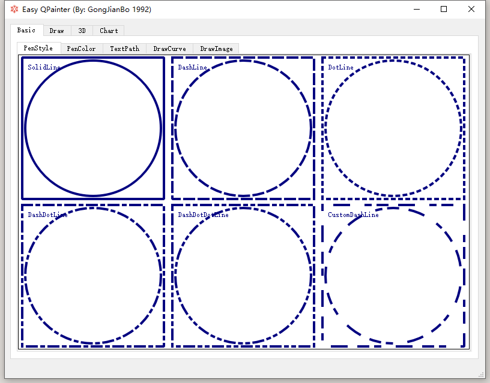
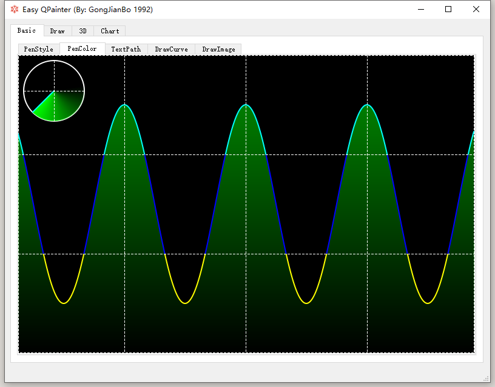
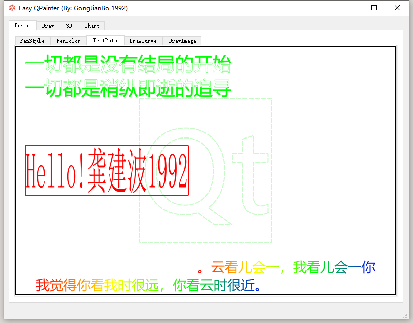
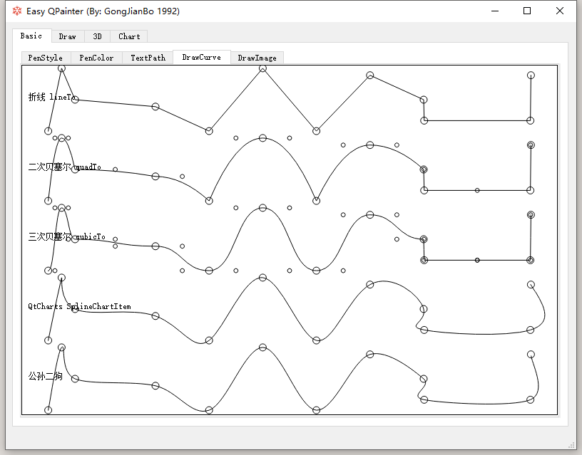
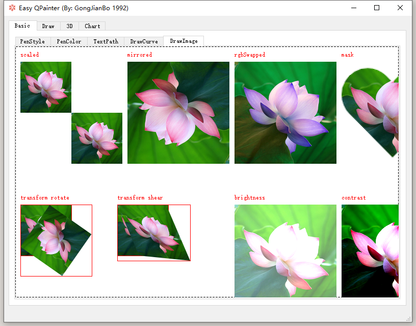
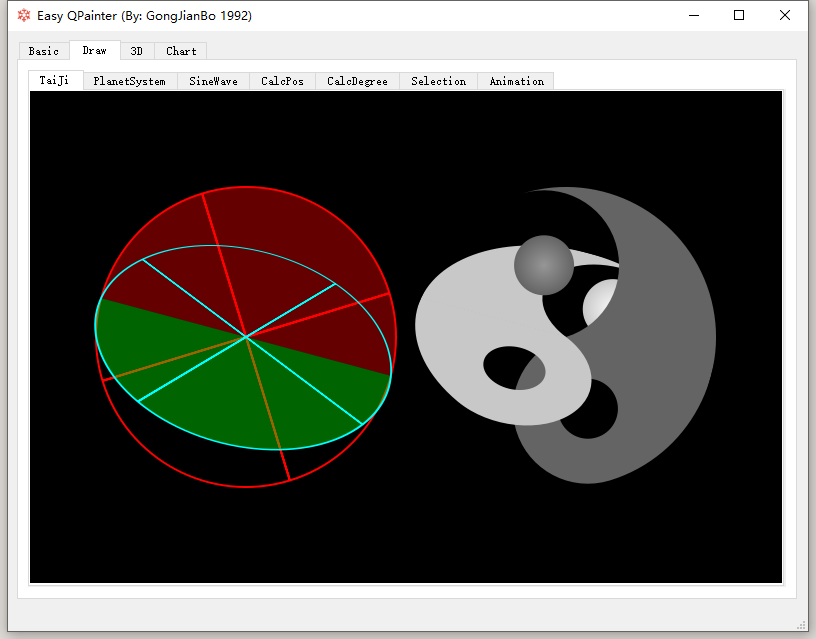
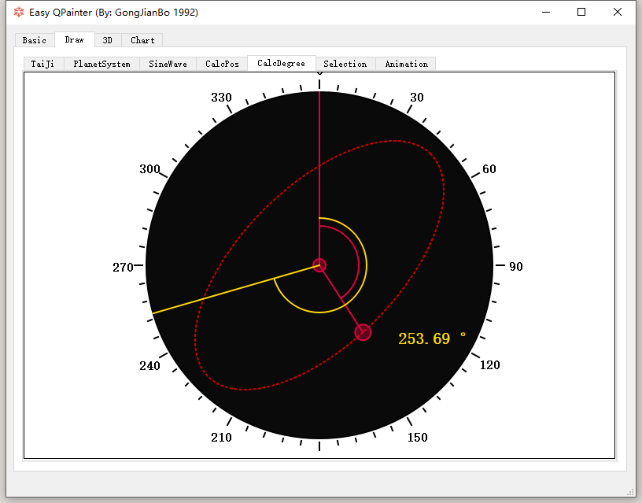
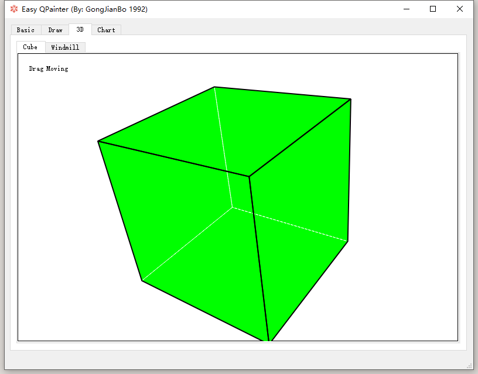
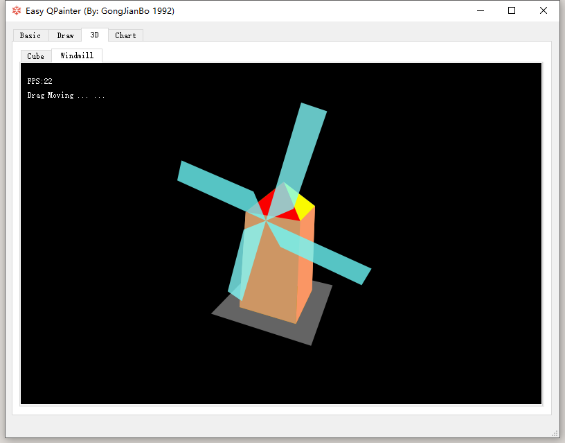
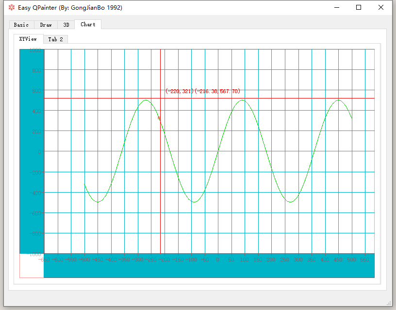

# EasyQPainter 
Various operation practices of Qt QPainer.（Qt QPainter的各种操作实践）
I named this demo "What is QPainer".（我给这个 Demo 命名为 "何为 QPainter"）
###### （旧代码在 v1.0.0 分支，QQ 交流群：647637553）

# Environment （开发环境）
（2021-10-23）Win10 64bit + Qt5.15.2 + MSVC2019 32/64bit

# Note  (备注)
（2021-07-01）
There might be some incompatibility between different QT version header directives, please adjust includes based on your QT SDK version. 
版本之间可能有些接口不兼容，或者头文件变动，请自行调整。如我 5.12 放到 5.15 上就需要显式引入 QPianterPath 了。

（2021-10-23）
Because a new interface needs to be added, the directory is reorganized and partially reconstructed. The old code is branched in v1.0.0.
由于需要增加新的界面，所以重新组织目录，并进行部分重构，原来的代码在 v1.0.0 分支。

# Demo Show （展示）

